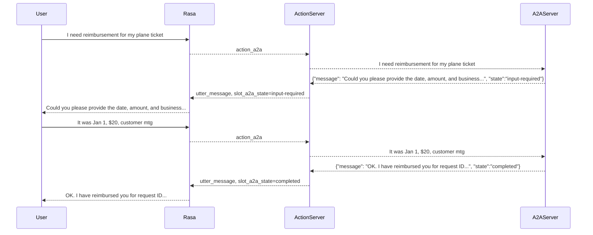

# Orchestrator Demo

This is a Rasa Orchestrator Demo bot to highlight the ability to use Rasa to orchestrate a conversation that involves multiple RAG's, agents ([A2A](https://developers.googleblog.com/en/a2a-a-new-era-of-agent-interoperability/)) and tools ([MCP](https://www.anthropic.com/news/model-context-protocol)).

The current demo implements two RAG's using Kapa: a Rasa RAG and a Kubernetes RAG. This is implemented via a [Rasa questions flow](./data/flows/rasa.yml) and [custom action](./actions/rasa_rag.py) and a Kubernetes [flow](./data/flows/kubernetes.yml) and [custom action](./actions/kubernetes_rag.py).

## Agent & MCP Integration

The agent and MCP integration is a work in progress. There's an [expense reimbursement flow](./data/flows/reimbursement.yml) that would call a custom action that implements the A2A client. The expense reimbursement agent can be found in the Google ADA examples [project](https://github.com/google/A2A/blob/main/samples/python/agents/google_adk/README.md). An example of the A2A protocol interactions can be found below.

The A2A repo has an [example](https://github.com/google/A2A/blob/main/demo/README.md) of an orchestrator that agent. A web UI can provide the url to A2A agents and the orchestrator [Host Agent](https://github.com/google/A2A/blob/main/samples/python/hosts/multiagent/host_agent.py) will register the agent at the provided url.

The idea with the flow is to repeatedly call the custom action until the agent indicates it is complete.

It should be easy to demo an MCP example via A2A.

Example interaction:



## A2A Integration

Google [announced](https://developers.googleblog.com/en/a2a-a-new-era-of-agent-interoperability/) the Agent2Agent protocol as a standardized method for agent interoperability. There is both [documentation](https://google.github.io/A2A/#/documentation) and a sample [repo](https://github.com/google/A2A). A python quickstart can be found [here](https://google.github.io/A2A/#/tutorials/python/1_introduction).

We'll use a configuration file named `a2a.yml` which the action server will read to connect to all of the available A2A agents. For our demo agent, the configuration is:

```yml
remote_agents:
  - name: expense_reimbursement_agent
    url: http://localhost:10002
```

### Run Sample Agent

This example uses a Google ADK example expense reimbursement agent which can be found [here](https://github.com/google/A2A/blob/main/samples/python/agents/google_adk/README.md).

To run the example expsnse reimbursement agent, do the following from within the A2A repo:

```sh
cd samples/python/agents/google_adk
echo "GOOGLE_API_KEY=your_api_key_here" > .env
uv run .
```

The agent should now be available at `http://localhost:10002`.


## Kapa Notes

Kapa supports two API endpoints:

- `search`: Returns the top-n results from the Kapa vector store (no generative response from Kapa). The url for this endpoint is `https://api.kapa.ai/query/v1`.
- `chat`: Returns a generative response from the Kapa RAG

## Setup

The following enviroment variables need to be set to access the Kapa RAG's for Rasa and Kubernetes:

```sh
export KAPA_RASA_PROJECT_ID=
export KAPA_RASA_TOKEN=
export KAPA_RASA_NUM_RESULTS=5
export KAPA_K8S_PROJECT_ID=
export KAPA_K8S_TOKEN=
export KAPA_K8S_NUM_RESULTS=5
export KAPA_GEN_LLM="gpt-4o"
export RAG_TEMPLATE="prompts/rag_completion.jinja2"
```

### kapa.ai API TOKEN

In root folder of project, create a .env file:

```sh
# Environment Variables to define for the action server.
# file: .env
KAPA_PROJECT_ID="<You Can Find The Token in 1Passwd>"
KAPA_TOKEN="<You Can Find The Token in 1Passwd>"
```

### Train & run

```sh
pip install uv
uv pip install -r requirements.txt

rasa train --domain domain

rasa run actions --debug
rasa inspect
```

## ToDo

- Clean-up repo
- Include conversation history in RAG prompt so you can ask a follow-up question
- A2A vs MCP
  - [A2A vs MCP](https://google.github.io/A2A/#/topics/a2a_and_mcp?id=example)
  - [A2A w/MCP architecture](https://google.github.io/A2A/#/?id=open-standards-for-connecting-agents)
- Implement example as A2A
  - [Google example](https://github.com/google/A2A/blob/main/samples/python/agents/google_adk/README.md)
  - [orchestrator agent](https://github.com/google/A2A/blob/main/samples/python/hosts/multiagent/host_agent.py)
- A2A as flow
  - Could an A2A card become a Rasa Flow & custom action that calls the agent
- Create a flow that handles "Rasa questions that require generative responses"
  - "Create a flow to deposit money in one of my bank accounts"
- Load docs in a json array that is processed by the jinja template
- Implement an MCP example via A2A
- Possible agentic platform demos
  - crewai
  - Smolagents
  - Bedrock agents
  - DSPy
  - LangChain/LangGraph
  - Pydantic AI
  - AutoGen
  - Goose

## Example APA Interaction

I believe (hope) the first response from the example agent is a bug when it reports status `completed` instead of `input-required`.

```json
uv run hosts/cli --agent http://localhost:10002

======= Agent Card ========
{"name":"Reimbursement Agent","description":"This agent handles the reimbursement process for the employees given the amount and purpose of the reimbursement.","url":"http://localhost:10002/","version":"1.0.0","capabilities":{"streaming":true,"pushNotifications":false,"stateTransitionHistory":false},"defaultInputModes":["text","text/plain"],"defaultOutputModes":["text","text/plain"],"skills":[{"id":"process_reimbursement","name":"Process Reimbursement Tool","description":"Helps with the reimbursement process for users given the amount and purpose of the reimbursement.","tags":["reimbursement"],"examples":["Can you reimburse me $20 for my lunch with the clients?"]}]}
=========  starting a new task ======== 

What do you want to send to the agent? (:q or quit to exit): can you reimburse me for my plane ticket
stream event => {"jsonrpc":"2.0","id":"55d1e4697a0c49da8eaf88314e441bc6","result":{"id":"dd6745735a954d13bfa2f0cf8ecd9bfe","status":{"state":"completed","message":{"role":"agent","parts":[{"type":"text","text":"Could you please provide the date, amount, and business justification/purpose for the plane ticket?\n"}]},"timestamp":"2025-04-14T12:02:43.554273"},"final":false}}
stream event => {"jsonrpc":"2.0","id":"55d1e4697a0c49da8eaf88314e441bc6","result":{"id":"dd6745735a954d13bfa2f0cf8ecd9bfe","artifact":{"parts":[{"type":"text","text":"Could you please provide the date, amount, and business justification/purpose for the plane ticket?\n"}],"index":0,"append":false}}}
stream event => {"jsonrpc":"2.0","id":"55d1e4697a0c49da8eaf88314e441bc6","result":{"id":"dd6745735a954d13bfa2f0cf8ecd9bfe","status":{"state":"completed","timestamp":"2025-04-14T12:02:43.554655"},"final":true}}
=========  starting a new task ======== 

What do you want to send to the agent? (:q or quit to exit): $5345 was the cost
stream event => {"jsonrpc":"2.0","id":"9f5f948fe0ec4d518d3070b2123c6935","result":{"id":"11ff540d5fbd451495e0ab28e1e14ea7","status":{"state":"input-required","message":{"role":"agent","parts":[{"type":"data","data":{"type":"form","form":{"type":"object","properties":{"date":{"type":"string","format":"date","description":"Date of expense","title":"Date"},"amount":{"type":"string","format":"number","description":"Amount of expense","title":"Amount"},"purpose":{"type":"string","description":"Purpose of expense","title":"Purpose"},"request_id":{"type":"string","description":"Request id","title":"Request ID"}},"required":["amount","date","purpose","request_id"]},"form_data":{"amount":"5345","date":"<transaction date>","purpose":"<business justification/purpose of the transaction>","request_id":"request_id_2779924"},"instructions":"Please fill out the form with the date and business justification/purpose of the transaction."}}]},"timestamp":"2025-04-14T12:03:05.620899"},"final":false}}
stream event => {"jsonrpc":"2.0","id":"9f5f948fe0ec4d518d3070b2123c6935","result":{"id":"11ff540d5fbd451495e0ab28e1e14ea7","artifact":{"parts":[{"type":"data","data":{"type":"form","form":{"type":"object","properties":{"date":{"type":"string","format":"date","description":"Date of expense","title":"Date"},"amount":{"type":"string","format":"number","description":"Amount of expense","title":"Amount"},"purpose":{"type":"string","description":"Purpose of expense","title":"Purpose"},"request_id":{"type":"string","description":"Request id","title":"Request ID"}},"required":["amount","date","purpose","request_id"]},"form_data":{"amount":"5345","date":"<transaction date>","purpose":"<business justification/purpose of the transaction>","request_id":"request_id_2779924"},"instructions":"Please fill out the form with the date and business justification/purpose of the transaction."}}],"index":0,"append":false}}}
stream event => {"jsonrpc":"2.0","id":"9f5f948fe0ec4d518d3070b2123c6935","result":{"id":"11ff540d5fbd451495e0ab28e1e14ea7","status":{"state":"input-required","timestamp":"2025-04-14T12:03:05.621211"},"final":true}}

What do you want to send to the agent? (:q or quit to exit): it was on january 1 for the kubernetes conference
stream event => {"jsonrpc":"2.0","id":"8756f808d31b49ebbad51626b8fc1185","result":{"id":"11ff540d5fbd451495e0ab28e1e14ea7","status":{"state":"completed","message":{"role":"agent","parts":[{"type":"text","text":"OK. I have reimbursed you for request ID request_id_2779924. The status is approved.\n"}]},"timestamp":"2025-04-14T12:03:32.500567"},"final":false}}
stream event => {"jsonrpc":"2.0","id":"8756f808d31b49ebbad51626b8fc1185","result":{"id":"11ff540d5fbd451495e0ab28e1e14ea7","artifact":{"parts":[{"type":"text","text":"OK. I have reimbursed you for request ID request_id_2779924. The status is approved.\n"}],"index":0,"append":false}}}
stream event => {"jsonrpc":"2.0","id":"8756f808d31b49ebbad51626b8fc1185","result":{"id":"11ff540d5fbd451495e0ab28e1e14ea7","status":{"state":"completed","timestamp":"2025-04-14T12:03:32.500869"},"final":true}}
=========  starting a new task ======== 

What do you want to send to the agent? (:q or quit to exit): 
```