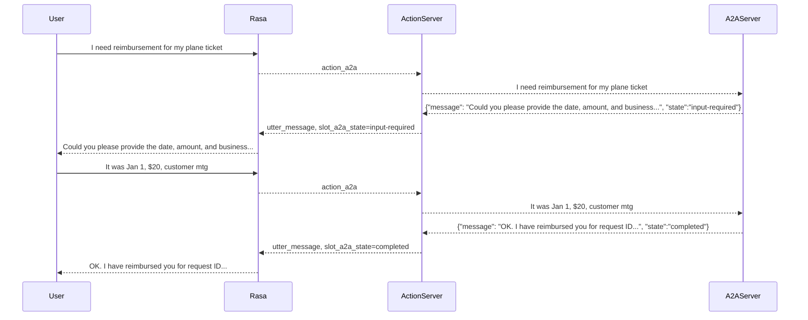

# Orchestrator Demo

This is a Rasa Orchestrator Demo bot to highlight the ability to use Rasa to orchestrate a conversation that involves multiple RAG's, agents ([A2A](https://developers.googleblog.com/en/a2a-a-new-era-of-agent-interoperability/)) and tools ([MCP](https://www.anthropic.com/news/model-context-protocol)).

The current demo implements two RAG's using Kapa and two A2A agents. The RAG's cover a Rasa questions and Kubernetes questions. This is implemented via a [Rasa questions flow](./data/flows/rasa.yml) and [custom action](./actions/rasa_rag.py) and a Kubernetes [flow](./data/flows/kubernetes.yml) and [custom action](./actions/kubernetes_rag.py). The two A2A agents are a Google agent kit expense reimbursement agent and a Langgraph currency exchange agent.

Example questions:

- What is the config.yml
- What is the kubectl command to show running pods
- I need reimbursement for my hotel room
- How many INR is one euro

## Agent Integration

The agent integration is a work in progress. There's an [expense reimbursement flow](./data/flows/reimbursement.yml) that calls a custom action that implements the A2A client and a [curreny exchange flow](./data/flows/currency_exchange.yml). The expense reimbursement agent has a [bug](https://github.com/google/A2A/issues/332) which causes it to frequently return a status of `completed` when the agent still needs input.

It should be easy to demo an MCP example via A2A. There's a discussion about an MCP version [here](https://github.com/google/A2A/issues/281) including an example [here](https://github.com/djsamseng/blpapi-a2a/blob/main/src/blpapi_a2a/blp_a2a_agent.py)

Example interaction:



## A2A Integration

Google [announced](https://developers.googleblog.com/en/a2a-a-new-era-of-agent-interoperability/) the Agent2Agent protocol as a standardized method for agent interoperability. There is both [documentation](https://google.github.io/A2A/#/documentation) and a sample [repo](https://github.com/google/A2A). A python quickstart can be found [here](https://google.github.io/A2A/#/tutorials/python/1_introduction).

We'll use a configuration file named `a2a.yml` which the action server will read to connect to all of the available A2A agents. For our demo agent, the configuration is:

```yml
remote_agents:
  - name: "Reimbursement Agent"
    url: http://localhost:10002
  - name: "Currency Agent"
    url: http://localhost:10000
```

### Run Sample Agents

This example uses two agents:

- Google ADK example expense reimbursement [agent](https://github.com/google/A2A/blob/main/samples/python/agents/google_adk/README.md)
- Langgraph currency exchange [agent](https://github.com/google/A2A/blob/main/samples/python/agents/langgraph/README.md)

To run the example agents, do the following from within the A2A repo in two terminals:

```sh
cd samples/python/agents/google_adk
echo "GOOGLE_API_KEY=your_api_key_here" > .env
uv run .
cd samples/python/agents/langgraph
echo "GOOGLE_API_KEY=your_api_key_here" > .env
uv run .
```

The agents should now be available at `http://localhost:10002` and `http://localhost:10000`.

## Kapa Notes

Kapa supports two API endpoints:

- `search`: Returns the top-n results from the Kapa vector store (no generative response from Kapa). The url for this endpoint is `https://api.kapa.ai/query/v1`.
- `chat`: Returns a generative response from the Kapa RAG

## Setup

The following enviroment variables need to be set to access the Kapa RAG's for Rasa and Kubernetes:

```sh
export KAPA_RASA_PROJECT_ID=
export KAPA_RASA_TOKEN=
export KAPA_RASA_NUM_RESULTS=5
export KAPA_K8S_PROJECT_ID=
export KAPA_K8S_TOKEN=
export KAPA_K8S_NUM_RESULTS=5
export KAPA_GEN_LLM="gpt-4o"
export RAG_TEMPLATE="prompts/rag_completion.jinja2"
```

### kapa.ai API TOKEN

In root folder of project, create a .env file:

```sh
# Environment Variables to define for the action server.
# file: .env
KAPA_PROJECT_ID="<You Can Find The Token in 1Passwd>"
KAPA_TOKEN="<You Can Find The Token in 1Passwd>"
```

### Train & run

```sh
pip install uv
uv pip install -r requirements.txt

rasa train --domain domain

rasa run actions --debug
rasa inspect
```

## ToDo

- Clean-up repo
- Include conversation history in RAG prompt so you can ask a follow-up question
- A2A vs MCP
  - [A2A vs MCP](https://google.github.io/A2A/#/topics/a2a_and_mcp?id=example)
  - [A2A w/MCP architecture](https://google.github.io/A2A/#/?id=open-standards-for-connecting-agents)
- Implement example as A2A
  - [Google example](https://github.com/google/A2A/blob/main/samples/python/agents/google_adk/README.md)
  - [orchestrator agent](https://github.com/google/A2A/blob/main/samples/python/hosts/multiagent/host_agent.py)
- A2A as flow
  - Could an A2A card become a Rasa Flow & custom action that calls the agent
- Create a flow that handles "Rasa questions that require generative responses"
  - "Create a flow to deposit money in one of my bank accounts"
- Load docs in a json array that is processed by the jinja template
- Implement an MCP example via A2A
- Possible agentic platform demos
  - crewai
  - Smolagents
  - Bedrock agents
  - DSPy
  - LangChain/LangGraph
  - Pydantic AI
  - AutoGen
  - Goose
